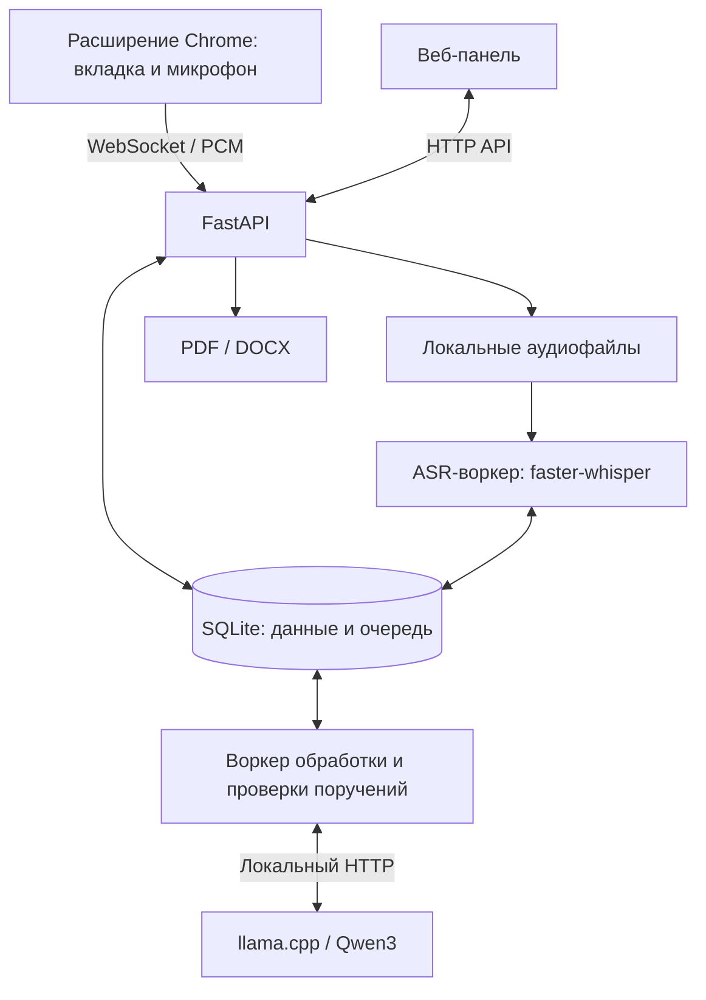

# Хаттама Live — локальный ИИ-протокол совещаний

**Хаттама Live превращает обсуждение в проверяемый протокол и список поручений:** что сделать, кто отвечает и к какому сроку. Система принимает звук встречи, распознаёт речь, выделяет итоги и поручения, сохраняет основания из расшифровки и передаёт результат секретарю на проверку. После утверждения протокол можно выгрузить в PDF/DOCX, а выполнение поручений — отслеживать в реестре.

Распознавание и анализ выполняются **локальными моделями**, без платных AI API. Интернет нужен для установки зависимостей, моделей и среды запуска; обработка подготовленной записи может выполняться без внешней сети.

**Статус: хакатонный прототип.** В веб-интерфейсе доступны «Встречи», «Протокол» и «Поручения». Экран управления записью пока отсутствует: ниже приведён сценарий через API и расширение Chrome. Подробные результаты предыдущих проверок — в [STATUS.md](STATUS.md).

## Содержание

- [Возможности и основной сценарий](#возможности-и-основной-сценарий)
- [Архитектура и технологии](#архитектура-и-технологии)
- [Структура репозитория](#структура-репозитория)
- [Требования](#требования)
- [Быстрый запуск без моделей](#быстрый-запуск-без-моделей)
- [Запуск с локальными моделями](#запуск-с-локальными-моделями)
- [Демонстрация от записи до протокола](#демонстрация-от-записи-до-протокола)
- [Воспроизведение и проверка решения](#воспроизведение-и-проверка-решения)
- [Настройки и данные](#настройки-и-данные)
- [Типичные проблемы](#типичные-проблемы)
- [Ограничения](#ограничения)

## Возможности и основной сценарий

Основной пользователь — **секретарь совещания**. Он создаёт встречу, указывает участников, проверяет результаты и утверждает протокол. Руководитель и исполнители работают с доступными им встречами и поручениями; доступ зависит от роли и участия во встрече.

1. **Подготовка:** название, дата, часовой пояс, язык и участники. Дата встречи служит точкой отсчёта для сроков вроде «через две недели».
2. **Запись:** после уведомления участников и подтверждения этого факта звук передаётся на локальный сервер. Расширение захватывает вкладку браузера и, по выбору пользователя, собственный микрофон.
3. **Обработка:** ASR формирует черновые и стабильные реплики; после остановки выполняются финальное распознавание и анализ текста.
4. **Проверка:** секретарь сверяет поручения с цитатами и временными отметками, исправляет текст, исполнителей и сроки, разрешает вопросы системы.
5. **Результат:** утверждённый PDF/DOCX и реестр поручений со статусами выполнения. Экспорт до утверждения помечается «ЧЕРНОВИК».

Пример из включённого синтетического диалога: «Пусть Ерлан до конца недели подготовит претензию, а вы за две недели найдите альтернативного поставщика». При проверке нужно убедиться, что это два поручения разным исполнителям, а условная фраза о расторжении договора не стала безусловной задачей. Это ориентир для оценки, а не обещание безошибочного ответа модели.

## Архитектура и технологии



| Слой | Технологии | Назначение |
| --- | --- | --- |
| Сервер | Python 3.11–3.12, FastAPI, Uvicorn, Pydantic 2 | API, валидация, авторизация, приём аудио |
| Данные | SQLAlchemy 2, Alembic, SQLite; предусмотрен PostgreSQL | Встречи, расшифровки, поручения, версии, очередь заданий |
| Интерфейс | HTML, CSS, JavaScript ES modules | Статическая панель, которую отдаёт FastAPI; отдельной сборки нет |
| Захват | Chrome Manifest V3, tabCapture, offscreen, AudioWorklet | Звук вкладки и отдельный канал микрофона |
| Передача | WebSocket, PCM16, протокол `hattama.audio.v1` | Подтверждения сохранения, повторная отправка при переподключении |
| Распознавание | faster-whisper 1.2.1, CTranslate2, Whisper large-v3-turbo, Silero VAD | Выделение речи, live-расшифровка, финальный проход |
| Анализ текста | llama.cpp server, Qwen3-4B Q4_K_M; профили с Qwen3-8B | Извлечение событий и итогов в JSON |
| Предметные правила | Python, Pydantic | Связывание поручений, сроки RU/KZ, проверка цитат и чисел |
| Говорящие | Разделение по источникам; опционально pyannote.audio | Разметка говорящих; pyannote требует отдельной подготовки |
| Экспорт | ReportLab, python-docx | PDF/DOCX с локальными шрифтами |
| Проверки | pytest, Node.js test runner | Модульные, интеграционные и модельные тесты |

Сервер подтверждает аудиокадры после записи на диск и `fsync`. Клиент хранит неподтверждённые кадры в ограниченном буфере и повторяет их после переподключения. Пропуски учитываются отдельно; при переполнении буфера возможна потеря звука. Формат и общие тест-векторы описаны в [спецификации аудиопротокола](packages/contracts/audio-frame-v1.md).

После остановки записи очередь выполняет `finalize → final_asr → diarize → extract_final`. LLM извлекает события из фрагментов расшифровки, затем правила связывают их в поручения и проверяют основания. Неоднозначности сохраняются как вопросы для человека. Очередь хранится в БД; Redis и Celery не требуются.

Обычный путь статусов встречи:

```text
DRAFT → READY → LIVE → PROCESSING → NEEDS_REVIEW → APPROVED
черновик  готова  запись  обработка   проверка       утверждена
```

Утверждение сохраняет снимок протокола и SHA-256. Для последующих правок создаётся новая версия. Статус проверки поручения и статус его выполнения хранятся отдельно.

## Структура репозитория

```text
.
├── apps/
│   ├── api/
│   │   ├── hattama/
│   │   │   ├── api/                       # API, WebSocket, права доступа
│   │   │   ├── ingest/                    # Приём и сохранение аудио
│   │   │   ├── asr/, audio/, live/         # Распознавание и обработка звука
│   │   │   ├── workers/, jobs/            # Воркеры и очередь в БД
│   │   │   ├── pipeline/, extraction/     # Анализ текста и поручений
│   │   │   ├── domain/, db/               # Правила и модели данных
│   │   │   ├── export/                    # PDF/DOCX и шрифты
│   │   │   └── modelstore/, diagnostics/, evaluation/
│   │   └── migrations/                   # Миграции Alembic
│   ├── web/static/                       # Веб-панель без сборки
│   ├── extension/src/                    # Расширение Chrome
│   └── meeting-agent/                    # Заготовка; бот не реализован
├── packages/contracts/                   # Протокол, Python-кодек, тест-векторы
├── packages/audio-client/                # JS-кодек, AudioWorklet, загрузчик
├── model-configs/                        # Профили, модели, ревизии и хеши
├── fixtures/audio/synthetic/             # Синтетические WAV и эталоны
├── scripts/                              # Генерация аудио на Windows
├── tests/unit/, tests/integration/       # Автоматические проверки
├── .env.example                          # Пример конфигурации
├── pyproject.toml, uv.lock               # Workspace и зависимости
├── tasks.py                              # Единая точка запуска команд
└── STATUS.md                             # Проверки и известные ограничения
```

## Требования

| Вариант | Требования |
| --- | --- |
| Интерфейс и тесты без моделей | Git, Python **3.11 или 3.12**, uv, Node.js **20+**, современный браузер |
| Полный вариант, проверенный ранее | Windows 11 x64, NVIDIA GPU с 6 ГБ VRAM, около 16 ГБ RAM, Chrome; оборудование указано в [STATUS.md](STATUS.md) |
| Обработка без NVIDIA GPU | ASR-зависимости, CPU-профиль, доступный `llama-server`; работа в реальном времени не гарантируется |
| Linux/macOS | Интерфейс и тесты запускаются общими командами; для полного анализа нужен отдельно установленный `llama-server` в `PATH` |

Базовые веса занимают около **4,1 ГБ**: Whisper — 1,6 ГБ, Qwen3-4B — 2,5 ГБ. Дополнительно нужны место для окружения, runtime и записей. Один источник моно PCM16 при 48 кГц занимает примерно 346 МБ за час.

## Быстрый запуск без моделей

Этот вариант позволяет проверить вход, создание встреч, API и тесты без скачивания весов. Новая база пустая: встроенных демонстрационных встреч нет, расшифровка и поручения появляются после обработки аудио.

### 1. Установка

Все команды выполняются **из корня репозитория**. Если код уже скачан, пропустите клонирование.

```bash
git clone https://github.com/BAITC-Hacks/hack-8a4ed672-ub.git
cd hack-8a4ed672-ub
python -m pip install --user uv
python tasks.py setup
```

На Linux/macOS до активации окружения может понадобиться `python3` вместо `python`. `setup` выполняет `uv sync --frozen`, используя зависимости из `uv.lock`.

### 2. Окружение и конфигурация

Windows PowerShell:

```powershell
.\.venv\Scripts\Activate.ps1
Copy-Item .env.example .env
```

Linux/macOS:

```bash
source .venv/bin/activate
cp .env.example .env
```

Если `.env` уже существует, сохраните свои настройки вместо повторного копирования. В `.env` установите:

```dotenv
HATTAMA_PROFILE=test
HATTAMA_ALLOWED_ORIGINS=["http://localhost:8000","http://localhost:5173"]
```

Профиль `test` предназначен для работы без моделей. Origin `5173` нужен тестовым клиентам и smoke-сценарию; сама панель работает на `8000`. Остальные настройки оставьте из `.env.example`.

После активации `python` должен указывать на `.venv`. Если активация недоступна, вместо `python` используйте `.venv\Scripts\python.exe` на Windows или `.venv/bin/python` на Linux/macOS, в том числе для `dev` и `llm`.

### 3. База и пользователь

```bash
python tasks.py migrate
python tasks.py create-user --email sec@example.kz --name "Секретарь" --role secretary
```

Терминал запросит пароль длиной **не менее 10 символов**. Стандартного пароля нет. Миграция обязательна перед первым `create-user`.

### 4. Запуск

```bash
python tasks.py dev --no-asr --no-llm
```

- Панель: [http://localhost:8000](http://localhost:8000).
- Проверка API: [http://localhost:8000/api/v1/health](http://localhost:8000/api/v1/health) — ожидается JSON со `status: "ok"`.
- Swagger UI: [http://localhost:8000/api/docs](http://localhost:8000/api/docs).
- Схема API: [http://localhost:8000/api/openapi.json](http://localhost:8000/api/openapi.json).

Войдите под `sec@example.kz`, создайте встречу, откройте карточку и проверьте поиск. Статус новой встречи — `DRAFT`; отсутствие расшифровки без моделей ожидаемо. Остановка — `Ctrl+C`.

Панели не нужны `npm install`, отдельный frontend-сервер или CDN. Swagger UI использует внешние ресурсы FastAPI; без интернета доступна OpenAPI JSON. Команда `python tasks.py contracts` экспортирует схемы в `packages/contracts/`.

## Запуск с локальными моделями

### Windows с NVIDIA GPU

Выполните базовую настройку выше и остановите режим без моделей. В активированном окружении:

```bash
python tasks.py setup --gpu
python tasks.py models-prepare
python tasks.py runtimes-prepare
```

`models-prepare` загружает Whisper large-v3-turbo CT2 и Qwen3-4B Q4_K_M. Ревизии и SHA-256 основных весов заданы в [манифесте моделей](model-configs/model-manifest.json). На Windows `runtimes-prepare` загружает закреплённую сборку llama.cpp **b11120 CUDA 12.4** по [манифесту runtime](model-configs/runtimes-manifest.json). `setup --gpu` также устанавливает Windows-зависимость cuBLAS.

В `.env` замените профиль на:

```dotenv
HATTAMA_PROFILE=gpu-6gb
```

Запустите полный стек:

```bash
python tasks.py dev
```

Команда применяет миграции и запускает API на `8000`, ASR-воркер, воркер обработки и LLM на `127.0.0.1:8081`. В другом терминале с активированным окружением:

```bash
python tasks.py doctor --asr-test --llm-test
```

Проверьте строки `asr-test` и `llm-test`. До запуска LLM ошибка `llm-endpoint` ожидаема. Необязательные модели могут иметь статус `SKIP`. `doctor` рекомендует профиль, но не меняет `.env`.

### Другие профили

Параметры находятся в [profiles.toml](model-configs/profiles.toml).

| Профиль | ASR | LLM | Назначение |
| --- | --- | --- | --- |
| `gpu-6gb` | CUDA, `int8_float16` | Qwen3-4B, GPU | Базовый вариант для GPU 6 ГБ |
| `gpu-large` | CUDA, `float16` | Qwen3-8B, GPU | GPU от 12 ГБ, RAM от 32 ГБ |
| `cpu` | CPU, `int8` | Qwen3-8B, CPU | Обработка с задержкой, нужен запас RAM |
| `cpu-8gb` | CPU, `int8` | Qwen3-4B, CPU | На 8 ГБ ASR и LLM лучше запускать по очереди |
| `test` | Без модели | Без модели | Проверки инфраструктуры |

Для CPU используйте `python tasks.py setup --asr`. Профилям `cpu` и `gpu-large` нужна дополнительная модель:

```bash
python tasks.py models-prepare --only qwen3-8b-q4_k_m
```

CPU-runtime для Windows можно подготовить так:

```powershell
python tasks.py runtimes-prepare --only llama.cpp-win-cpu
$env:PATH = "$env:LOCALAPPDATA\Hattama\tools\llama.cpp\b11120-win-cpu;$env:PATH"
```

Пример использует стандартный каталог инструментов. Раннер сначала ищет подготовленный CUDA-runtime; если он уже установлен, для явного выбора CPU запускайте CPU `llama-server.exe` отдельно с параметрами профиля, а приложение — с `dev --no-llm`.

На Linux/macOS `tasks.py llm` ищет `llama-server` в `PATH`; совместимую сборку нужно установить отдельно. Автоматической подготовки runtime для этих ОС нет. Сообщения раннера о `deploy/compose.yaml` устарели: **Docker Compose в репозитории отсутствует**.

Для 8 ГБ RAM возможен ручной режим: запись через `dev --no-llm`, ожидание окончания финального ASR, остановка `dev`, затем `python tasks.py llm` в одном терминале и `python tasks.py dev --no-asr --no-llm` в другом. Не останавливайте ASR до завершения финальной расшифровки. Работоспособность полного цикла на 8 ГБ не гарантируется.

После подготовки `dev`, тесты и `smoke-local` ничего не скачивают. Сама видеовстреча Meet/Teams/Zoom при этом продолжает использовать сеть своей платформы.

## Демонстрация от записи до протокола

Для этого сценария нужен полный стек с моделями. Живые проверки расширения в Meet, Teams Web и Zoom Web в [STATUS.md](STATUS.md) отмечены как `NOT_RUN`. Автоматическая проверка без видеоплатформы описана в следующем разделе.

### 1. Расширение Chrome

```bash
python tasks.py build-extension
```

Откройте `chrome://extensions` → «Режим разработчика» → «Загрузить распакованное» → `apps/extension/dist`. При необходимости разрешите микрофон на странице настройки расширения.

### 2. Встреча и код сопряжения

Войдите как секретарь, создайте встречу с участниками и откройте её карточку: адрес должен оканчиваться на `/#/m/<id>`. **Уведомите участников о записи до следующего шага.**

Поскольку кнопки записи в текущей панели нет, откройте инструменты разработчика браузера → Console на странице встречи и выполните код ниже. Он подтверждает уведомление участников, создаёт сессию записи и выводит одноразовый код. Используются текущая сессия и штатный CSRF-токен.

```javascript
(async () => {
  const meetingId = location.hash.match(/^#\/m\/([a-f0-9]+)$/)?.[1];
  if (!meetingId) throw new Error('Откройте карточку встречи.');
  const response = await fetch('/api/v1/auth/me');
  if (!response.ok) throw new Error('Сначала войдите в систему.');
  const session = await response.json();
  async function post(path, body) {
    const response = await fetch(`/api/v1${path}`, {
      method: 'POST',
      headers: {
        'content-type': 'application/json',
        'x-csrf-token': session.csrf_token,
      },
      body: JSON.stringify(body),
    });
    const data = await response.json();
    if (!response.ok) throw new Error(JSON.stringify(data));
    return data;
  }
  await post(`/meetings/${meetingId}/consent`, { confirmed: true });
  const capture = await post(`/meetings/${meetingId}/capture-sessions`, {
    mode: 'companion',
  });
  console.log('Код сопряжения:', capture.pairing.code);
  console.log('Действует до:', capture.pairing.expires_at);
})();
```

Код действует 5 минут и используется один раз. Пока сессия активна, повторный вызов создания сессии выдаёт новый код. Эквивалентные API: `POST /api/v1/meetings/{id}/consent` и `POST /api/v1/meetings/{id}/capture-sessions`.

### 3. Запись и обработка

1. Откройте вкладку браузерной встречи и значок расширения. Укажите `http://localhost:8000`, код и нажмите «Подключить».
2. Нажмите «Начать запись этой вкладки». Следите за уровнем звука и показателем «Сохранено (ACK)».
3. Собственный микрофон изначально выключен. При включении в расширении он записывается **независимо от mute в Meet/Teams/Zoom**. Используйте наушники для предотвращения эха.
4. Проведите короткое обсуждение с явными поручениями, исполнителями и сроками. Нажмите «Остановить запись» в расширении.
5. Обновите страницу встречи и дождитесь `PROCESSING → NEEDS_REVIEW`.

### 4. Проверка и результат

Откройте «Транскрипт», проверьте текст и аудио. Кнопка с временной отметкой в поручении открывает основание. Через «Проверить» исправьте действие, исполнителя и срок; ложную задачу отклоните кнопкой «Не поручение». Разрешите вопросы системы, при необходимости сопоставьте говорящих с участниками.

После проверки и устранения блокирующих вопросов нажмите «Утвердить»: ожидаемый статус — `APPROVED`. Через «Скачать» выберите PDF или DOCX. До утверждения документ содержит отметку черновика.

В разделе «Поручения» проверьте поиск, фильтры, сроки и доступную пользователю смену статуса выполнения. Для правок утверждённого протокола создайте новую версию через карточку встречи.

## Воспроизведение и проверка решения

### Без GPU и моделей

После установки и активации `.venv` выполните из корня репозитория:

```bash
python tasks.py test --no-node
node --test packages/audio-client/protocol.test.mjs
node --test apps/web/ui.test.mjs
python tasks.py test-integration
python tasks.py smoke-local
```

Если существует `.env`, оставьте в `HATTAMA_ALLOWED_ORIGINS` оба адреса из инструкции запуска: тестовые клиенты используют `http://localhost:5173`. Отдельно запущенный API не нужен. Тесты работают с временной SQLite; smoke создаёт собственную временную базу.

| Проверка | Что подтверждает | Ожидаемый результат |
| --- | --- | --- |
| `test --no-node` | Протокол, хранение, ресэмплинг, live-транскрайбер, сроки RU/KZ, связывание событий | `78 passed` |
| `protocol.test.mjs` | Совместимость JS-кодека с общими тест-векторами | 2 теста успешно |
| `ui.test.mjs` | Сроки, часовой пояс, экранирование текста | 4 теста успешно |
| `test-integration` | API, права доступа, WebSocket, переподключение, финализация, данные панели | `11 passed, 1 deselected` |
| `smoke-local` | Аудио → сопряжение → WebSocket → сохранение → остановка | `INGEST_ONLY`, JSON в `reports/runs/` |

Эти результаты повторно получены **23.09.2026 на macOS, Python 3.12.14, Node.js 24.7.0**. Исключённый интеграционный тест требует реальной модели. `tasks.py test` без `--no-node` на Node.js 24 падает при передаче каталога JS-тестов; явный путь к файлу выше обходит проблему.

`INGEST_ONLY` подтверждает приём аудио, но не распознавание и анализ. Smoke использует отдельную временную базу, поэтому его встреча не появится в рабочей панели.

### Полный прогон с моделями

Подготовьте ASR-зависимости, модели и runtime, выберите рабочий профиль вместо `test`. Остановите `dev`, чтобы не загружать вторую копию ASR. В первом терминале запустите только LLM:

```bash
python tasks.py llm
```

После готовности сервера во втором терминале, с активированным окружением и тем же профилем:

```bash
python tasks.py smoke-local --with-models
```

Прогон сам запускает API внутри процесса: синтетический WAV → приём → live ASR → финальный ASR → говорящие → поручения → `NEEDS_REVIEW` → экспорт черновиков PDF/DOCX. Внешние подключения блокируются внутри процесса smoke; локальный LLM должен быть запущен заранее.

В `reports/runs/smoke-<дата-время>.json` проверьте:

- `with_models: true`, `result: "PASS"`;
- в массиве `steps` у шага `analysis` — `meeting_status: "NEEDS_REVIEW"`;
- у `export_pdf` и `export_docx` — `http: 200`, ненулевой `bytes`, `draft: true`;
- `egress_attempts: []`;
- содержимое `actions`: действия, исполнители, сроки и причины ручной проверки.

Скрипт выставляет `PASS` по статусу `NEEDS_REVIEW` и отсутствию внешних подключений. Это **не оценка точности всех поручений**: содержание и результаты экспорта нужно проверить отдельно. Экспорт находится во временном каталоге `hattama-smoke-*` в системной папке временных файлов; JSON-отчёт — в игнорируемом Git каталоге `reports/runs/`.

Предыдущий полный прогон на Windows с RTX 3060 Laptop 6 ГБ описан в [STATUS.md](STATUS.md). При обновлении этого README полный модельный прогон повторно не выполнялся.

### Проверка реального ASR и тестовые данные

После подготовки Whisper и NVIDIA GPU можно отдельно запустить:

```bash
python -m pytest tests/integration/test_live_vertical_models.py -m models -q -s
```

Тест выбирает профиль `gpu-6gb`. При прямом запуске pytest задайте правильный `HATTAMA_MODELS_DIR`; на Windows стандартный путь — `%LOCALAPPDATA%\Hattama\models`. В выводе ожидается `LIVE_VERTICAL_RESULT`: требуется WER менее 0,35 и минимум 4 из 5 ключевых терминов. WER — доля ошибок относительно эталонного текста; меньше — лучше. `SKIPPED / NOT_RUN` при отсутствии модели не означает успешную модельную проверку.

В [fixtures/audio/synthetic](fixtures/audio/synthetic) включены три русскоязычных WAV, эталонные тексты и границы реплик: передача поручений, уточнение срока, числовые факты. Это **синтетическая речь**, а не реальные совещания. Для пересоздания на Windows с установленными голосами Microsoft Irina и Microsoft Pavel:

```bash
python scripts/make_synthetic_audio.py
```

Генератор перезаписывает WAV и `.ref.json`. Для сравнения прогонов используйте включённые WAV с одинаковым входом. Проверки текстовых правил RU/KZ не заменяют оценку казахской и смешанной речи на аудиозаписях.

## Настройки и данные

Пример — [.env.example](.env.example), полный список — [config.py](apps/api/hattama/config.py).

| Переменная | Назначение |
| --- | --- |
| `HATTAMA_PROFILE` | Профиль ресурсов |
| `HATTAMA_DATA_DIR` | База SQLite, звук, документы |
| `HATTAMA_MODELS_DIR` | Локальные модели |
| `HATTAMA_TOOLS_DIR` | Нативные инструменты, включая llama.cpp |
| `HATTAMA_DATABASE_URL` | Переопределение БД; по умолчанию SQLite |
| `HATTAMA_ALLOWED_ORIGINS` | Разрешённые origin веб-клиентов, JSON-массив |
| `HATTAMA_ALLOWED_EXTENSION_IDS` | Разрешённые ID расширений, JSON-массив |
| `HATTAMA_LLM_BASE_URL` | LLM, по умолчанию `http://127.0.0.1:8081` |
| `HATTAMA_LLM_ALLOWED_HOSTS` | Разрешённые хосты LLM; в примере только loopback |
| `HATTAMA_DEFAULT_TIMEZONE` | По умолчанию `Asia/Almaty` |
| `HATTAMA_COOKIE_SECURE` | `false` для локального HTTP, `true` для HTTPS |

Стандартный корень при запуске через `tasks.py`: Windows — `%LOCALAPPDATA%\Hattama`, Linux/macOS — `~/.local/share/hattama`. Внутри — `data`, `models`, `tools`; в `data` находятся `hattama.sqlite3`, `captures/` и `exports/`.

**Особенность раннера:** `tasks.py` задаёт три переменные каталогов в окружении дочерних процессов. Для переопределения укажите `HATTAMA_DATA_DIR`, `HATTAMA_MODELS_DIR`, `HATTAMA_TOOLS_DIR` в окружении терминала **до запуска**, а не только в `.env`. На Linux/macOS можно задать общий `HATTAMA_HOME`. При прямом `python -m hattama...` без переменных стандартный путь Linux/macOS — `/var/lib/hattama`; для обычного запуска используйте `tasks.py`.

Не добавляйте `.env`, записи и модели в Git; исключения предусмотрены в `.gitignore`. Для локального хранения не размещайте данные в синхронизируемых папках OneDrive/Dropbox.

Пароли хешируются Argon2, вход использует HttpOnly-сессию, изменяющие запросы — CSRF-токен. Запись требует подтверждения уведомления участников. Сервер по умолчанию слушает `127.0.0.1`; LAN требует отдельной настройки доступа и HTTPS/WSS и не входит в проверенный сценарий.

## Типичные проблемы

| Симптом | Решение |
| --- | --- |
| Нет `.venv` или Python-модуля | Выполните `setup`, активируйте `.venv`, особенно перед `dev` и `llm` |
| `no such table: users` | Перед `create-user` выполните `python tasks.py migrate` |
| Ошибка Origin / CSRF | Откройте именно `http://localhost:8000`, войдите снова; `127.0.0.1` и `localhost` — разные origin. Для тестов нужен `localhost:5173` |
| Модель не подготовлена | Выполните `models-prepare`, проверьте каталог и профиль; 8B загружается отдельно |
| `llama-server не найден` | На Windows выполните `runtimes-prepare`; для других вариантов проверьте runtime и `PATH` |
| Нет CUDA DLL / GPU | Проверьте `setup --gpu`, драйвер и `doctor --asr-test`; без совместимой GPU используйте CPU-профиль |
| Встреча остаётся `PROCESSING` | Проверьте ASR-воркер, LLM и вывод воркера обработки; без моделей анализ недоступен |
| Код сопряжения истёк | Получите новый код; при отказе в доступе сверьте ID расширения с `HATTAMA_ALLOWED_EXTENSION_IDS` |
| Нет кнопки записи | Используйте описанный сценарий API + расширение |
| Нельзя утвердить | Нужен `NEEDS_REVIEW` без блокирующих вопросов; при конфликте версии обновите страницу |
| JS-тесты не находят `audio-client` | Используйте `test --no-node` и явный путь к `protocol.test.mjs` |
| Порт занят | Остановите прежний сервер или используйте `dev --port 8001`, добавив origin в настройки и адрес в расширение |

## Ограничения

- **Точность:** Qwen3-4B может пропускать поручения, путать исполнителей и создавать задачи из описательных фраз. Проверка человеком обязательна; правила обнаруживают лишь часть ошибок.
- **Языки:** предусмотрены `ru`, `kk`, `mixed`, `auto`, есть тесты правил сроков RU/KZ. Аудиопроверки покрывают только синтетическую русскую речь; качество KZ/MIX не подтверждено.
- **Говорящие:** без pyannote различаются источники, а не каждый человек в смешанном звуке. Диаризация pyannote не проверена; веса требуют принятия условий доступа на Hugging Face.
- **Интерфейс:** нет экрана записи, загрузки аудиофайлов, отдельного мобильного сценария и внешней рассылки. Backend-приём микрофона сохранён, но кнопки в текущей панели нет.
- **Интеграции:** захват Meet/Teams Web/Zoom Web требует живой проверки в Chrome. Desktop-клиенты Zoom/Teams и бот-участник не поддерживаются.
- **Развёртывание:** нет Docker Compose и готового офлайн-пакета. PostgreSQL, LAN, HTTPS/WSS не прошли отдельную проверку; автоматическое удаление записей не реализовано.
- **Оценка качества:** нет большого набора реальных совещаний RU/KZ/MIX и итоговых метрик полноты/точности поручений. Технические тесты не заменяют такую оценку.

Источники и лицензии моделей перечислены в [model-manifest.json](model-configs/model-manifest.json), runtime — в [runtimes-manifest.json](model-configs/runtimes-manifest.json). Лицензия шрифта DejaVu — [LICENSE_DEJAVU](apps/api/hattama/export/fonts/LICENSE_DEJAVU).
